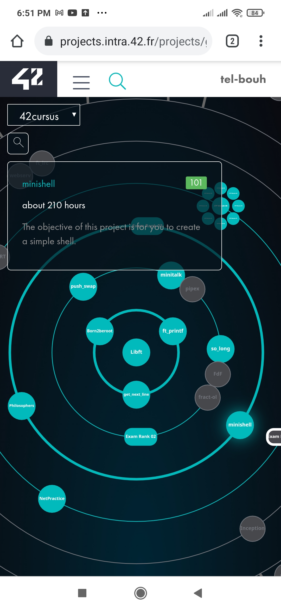

# Minishell: the eighth pjoject in 42 cursus.

The aim of this project is create a program in c that simulate shell.

## Table of contents

- [ Minishell: ](#the-eighth-pjoject-in-42-cursus.)
  - [Table of contents](#table-of-contents)
  - [Overview](#overview)
  - [The project](#the-project)
  - [Screenshot](#screenshot)

## Overview

This project is about creating a simple shell.
learn a lot about processes and file descriptors.

### The project

The project is about a C program that take inpute form the standard input (command prompt) execute it and display the resultbon the standard output.

### Screenshot

